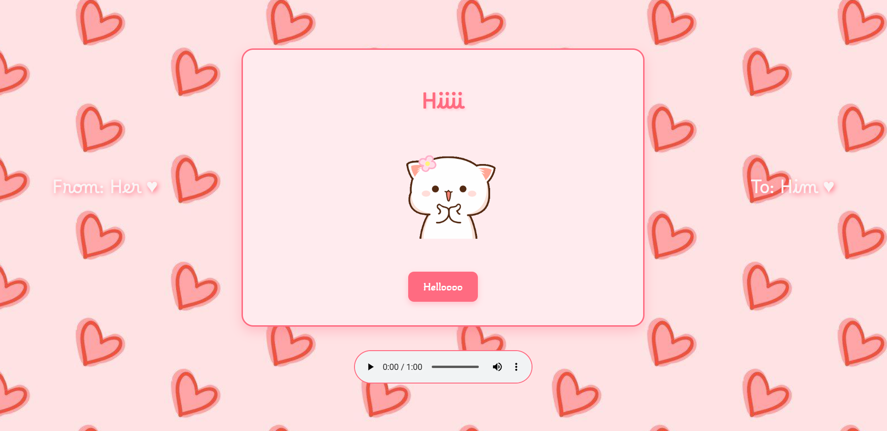
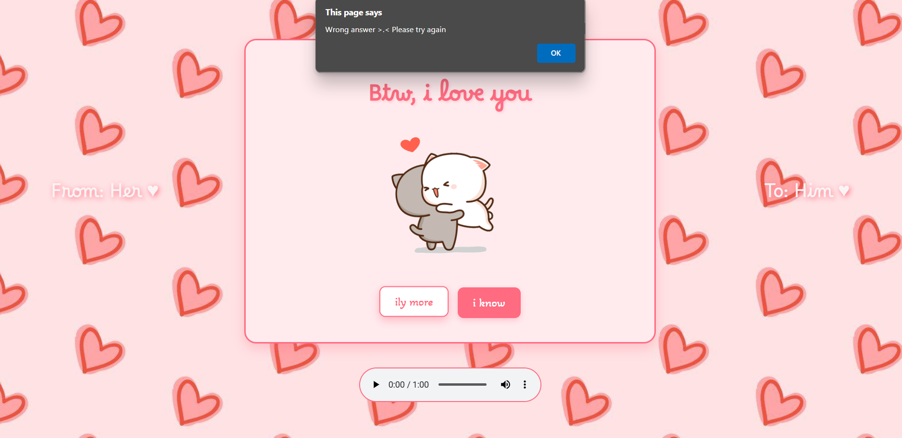
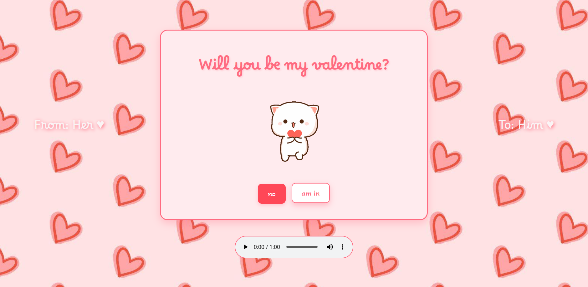

# valentines
Cute Valentines' invitation - an interactive webpage for valentines invitation

---

HTML, CSS & JavaScript

## How to Use

1. Download or clone the repository.
2. Open `[localpath]/index.html` in your browser to start interacting with the page.

## Screenshots

